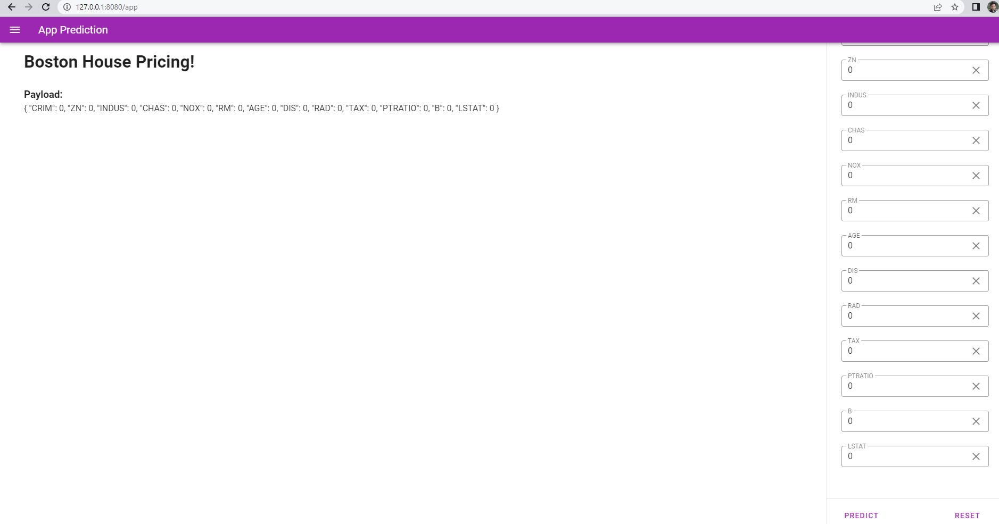

# Model Serving with FAST-API
This repo represent on how backend service was create using python fast-api framework to perform machine learning endpoint of boston house pricing with request body as the same on 13 feature by the dataset. This service receive the 13 feature as request and return the prediction based on Linear Regression model by Scikit-Learn.

## Project Structure
- main - represent entry point of app
- inference - represent inference or predict function and model methods
- models - represent request struct for the endpoint
- routes - represent the routing endpoint

# Prerequisites
Using some python environment (this repo using conda/miniconda) and install requirement with `pip install -r requrements.txt`

## Test the program
1. cd to current directory
2. run on command line 
    ```
    uvicorn main:app --reload
    ```
3. access the swagger documentation
    ```
    localhost:8000/docs
    ```
    
4. access webapp
    ```
    localhost:8000/app
    ```
    